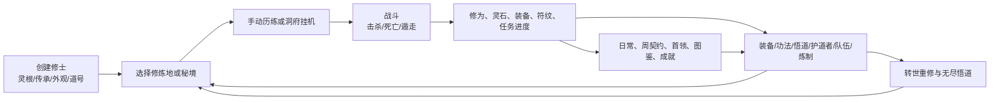

# 凡修录：游戏机制、玩法与页面元素总档案

> 用途：这是后续调整玩法、删减功能、重做 UI、迁移存档和拆分规则时的工作底稿。
>
> 本文记录的是 **当前冻结旧版的真实行为** 与 **当前项目已抽取的规则能力**，不是对新玩法的承诺。数值以生成数据文件为准；页面以 `legacy/fanxiulu-monolith.html` 为准；新玩法应优先写入 `src/game-core`，不能直接回写冻结单体。

## 1. 阅读方式与范围

### 1.1 三层现状

| 层级 | 当前职责 | 是否为默认玩家运行时 | 后续改玩法时的处理方式 |
| --- | --- | --- | --- |
| 冻结旧版 | 完整旧 UI、所有旧交互、历史存档兼容与行为参照 | 是。`/` 通过 iframe 加载运行副本 | 只作参照与回归夹具，不再向其中新增玩法 |
| 纯规则核心 | 装备、功法、战斗结算、队伍、首领、挂机/离线、随机数、存档适配 | 否，部分能力已被实验原生入口调用 | 新机制的首选落点 |
| 原生 Vue 实验入口 | 角色、背包、战斗、挂机等基础界面原型 | 否。`/?native=1` | 先做功能等价，最后才统一重做皮肤与交互 |

### 1.2 主要来源

- 冻结页面与完整旧逻辑：[legacy/fanxiulu-monolith.html](legacy/fanxiulu-monolith.html)
- 静态角色、世界、装备、功法、符纹数据：[src/game-core/data](src/game-core/data)
- 纯玩法规则：[src/game-core/systems](src/game-core/systems)
- 旧档字段初始化：[legacy-character.factory.ts](src/game-core/save/legacy-character.factory.ts)
- 当前玩法改造路线：[GAMEPLAY_CHANGE_GUIDE.md](GAMEPLAY_CHANGE_GUIDE.md)
- 非 UI 重构门禁：[NON_UI_READINESS.md](NON_UI_READINESS.md)

### 1.3 术语对照

旧版原始概念已经做了修仙化显示，但历史存档和冻结数据仍保留部分英文兼容键。本文以玩家可见名称为主。

| 玩家可见名称 | 冻结数据/旧概念 | 说明 |
| --- | --- | --- |
| 境界 / 修为 | Level / XP | 当前仍是连续等级制，而不是境界突破制 |
| 灵石 | Gold | 通用经济货币 |
| 气血 / 法力 | HP / MP | 战斗资源 |
| 六维属性 | STR/DEX/CON/INT/WIS/CHA | 体魄、身法、根骨、神识、悟性、福缘 |
| 初始传承 | Class | 当前决定基础面板、每级成长、功法书和专属试炼 |
| 灵根/体质 | Race | 当前主要是创建限制与身份数据，尚未形成独立成长体系 |
| 功法 | Spell | 有法力、冷却、目标和效果类型 |
| 悟道 | Alternate Ascension / AA | 51 级后将部分修为转为悟道点的成长树 |
| 转世重修 | Prestige | 100 级后重置换取永久收益的循环成长 |
| 护道者 | Mercenary | 付费雇佣、带冷却和行为的同伴 |
| 同行 | Group | 本地小号、护道者和借用英雄组成的队伍 |

## 2. 游戏总循环

核心体验可以概括为：**选区刷怪 → 获得修为/灵石/掉落 → 增强角色与自动化能力 → 挑战更高区域、首领、秘境和长线收集。**

当前并不存在五行相克、身法先攻、真正的行动队列、灵根差异成长或境界突破流程；这些均是后续新玩法的候选改造项，而非已生效机制。

## 3. 角色、成长与存档设定

### 3.1 角色创建

创建流程分四步，位于角色库的“开辟新道途”入口：

1. **测定灵根/体质**：16 种身份可选。
2. **选择初始传承**：16 种传承，创建页会按灵根—传承兼容表过滤；当前版本中很多限制接近全开放，但规则表仍存在。
3. **塑造道身**：头像预览，以及发型、发色、胡须、瞳色、肤色、衣袍/裤装颜色等外观参数；可随机、重置、返回上一步。
4. **赐下道号**：2–24 字符；可随机命名；可勾选“生死道”。确认后产生一个初始存档槽。

“生死道”效果：修为和灵石获得量各提高 25%，但死亡会永久删除该角色槽，并记录进生死道名录。普通道途死亡则扣除资源并可回收遗体。

### 3.2 初始传承

现有 16 个传承及其当前定位：

| 传承 | 当前定位 | 起始战斗倾向 |
| --- | --- | --- |
| 炼体士 | 正面近战、承伤 | 高气血、防御与近战攻击 |
| 丹医 | 治疗/保护 | 高法力、治疗功法 |
| 金刚护法 | 护卫兼辅助 | 均衡近战与疗愈 |
| 猎妖修士 | 远程生存 | 身法倾向、连射/恢复 |
| 尸道修士 | 阴煞近战 | 吸取、腐蚀与伤害 |
| 木灵法修 | 自然系术法 | 恢复与术法伤害 |
| 武僧 | 高速近战 | 身法、连击、控制 |
| 音修 | 辅助/法力 | 音律伤害、回复与削弱 |
| 影修 | 爆发刺杀 | 高攻击、精准爆发与毒伤 |
| 灵祭师 | 诅咒/治疗 | 毒伤、削弱、回复 |
| 鬼道修士 | 腐蚀/吸生 | 毒伤与自疗 |
| 五行法修 | 术法爆发 | 高法力、火系/法术伤害 |
| 御灵法修 | 元素术法 | 多段术法爆发 |
| 神识法修 | 控制/法力 | 削弱和法力回复 |
| 御兽师 | 攻击与灵兽主题 | 物理、毒伤、自疗 |
| 血煞体修 | 高风险近战 | 高攻击、削弱与回复 |

每个传承目前拥有：基础 HP/MP/攻击/防御/回灵、六维基础倾向、一个快捷传承技能、6 本可学习功法，以及一条专属史诗试炼与其史诗功法。完整数据在 [characters.generated.ts](src/game-core/data/characters.generated.ts) 与 [spells.generated.ts](src/game-core/data/spells.generated.ts)。

#### 正式中文身份 ID 与冻结兼容键

新玩法核心已将灵根/体质和初始传承的**正式领域 ID**改为中文；英文键只在读取冻结静态数据、导入旧存档和写回旧版兼容档时使用。这个边界十分重要：今后改灵根、天赋或成长时，应改中文领域模型，而不是全局替换冻结 HTML 中的旧字符串。

| 初始传承正式 ID | 冻结兼容键 | 灵根/体质正式 ID | 冻结兼容键 |
| --- | --- | --- | --- |
| 炼体士 | `Warrior` | 五行杂灵根 | `Human` |
| 丹医 | `Cleric` | 厚土灵体 | `Goliath` |
| 金刚护法 | `Paladin` | 光明灵体 | `Aasimar` |
| 猎妖修士 | `Ranger` | 木天灵根 | `Wood Elf` |
| 尸道修士 | `Death Knight` | 金天灵根 | `High Elf` |
| 木灵法修 | `Druid` | 暗灵根 | `Dark Elf` |
| 武僧 | `Monk` | 木水双灵根 | `Half Elf` |
| 音修 | `Bard` | 锻金之体 | `Dwarf` |
| 影修 | `Rogue` | 不灭之体 | `Troll` |
| 灵祭师 | `Shaman` | 巨力灵体 | `Ogre` |
| 鬼道修士 | `Necromancer` | 风木双灵根 | `Halfling` |
| 五行法修 | `Wizard` | 通明灵体 | `Gnome` |
| 御灵法修 | `Conjurer` | 蛟血灵体 | `Lizardfolk` |
| 神识法修 | `Enchanter` | 疾风灵体 | `Tabaxi` |
| 御兽师 | `Beastmaster` | 水土双灵根 | `Bullywug` |
| 血煞体修 | `Berserker` | 真龙血脉 | `Dragonborn` |

映射与类型守卫位于 [character-identity.ts](src/game-core/domain/character-identity.ts)。目前灵根/体质仍只承担创建兼容、身份展示和传承筛选，**尚未**影响元素、成长、突破或功法亲和；它正是后续差异化设计应优先接管的领域。

### 3.3 六维属性

| 属性 | 当前影响 | 现状限制 |
| --- | --- | --- |
| 体魄 | 攻击能力 | 没有独立的元素或武器熟练度分支 |
| 身法 | 会心、闪避 | **不决定先攻**；当前并非回合制行动顺序属性 |
| 根骨 | 伤害减免/耐久 | 主要通过固定减伤或防御折算表现 |
| 神识 | 功法伤害 | 不区分术法元素 |
| 悟性 | 法力恢复 | 不直接影响修行流派/突破 |
| 福缘 | 灵石获取 | 不直接控制稀有掉落保底 |

六维来自传承基础值、每 4 级一次的传承成长、装备词缀/套装、悟道节点和部分状态效果。当前六维显示为“基础值 + 装备/额外值”，并非后续拟议的灵根天赋系统。

### 3.4 等级、修为与成长

- 初始 1 级；击杀、任务、挂机与离线结算提供修为。
- 达到 `xpNext` 时升级；升级会提高最大气血、最大法力、攻击、防御，并以传承为基础重掷/更新六维成长。
- 当前每级成长按传承基数与等级段计算：80 级后 HP/MP 增长加快，60/70 级后攻击/防御开始带额外增量。
- 51 级后可设置“转入悟道的修为百分比”；被转出的部分不再计入普通升级。
- 队伍经验使用 1–6 人的倍率表后，再按有效分配人数平分；满 6 人时总修为倍率为 7.2，等于每人比单人多 20%。

公式实现见 [legacy-progression.ts](src/game-core/systems/progression/legacy-progression.ts)。

### 3.5 角色存档的主要领域字段

下表是后续改造时最容易受影响的字段分组；不是完整 JSON schema，但覆盖玩家系统。

| 分组 | 主要字段 | 用途 |
| --- | --- | --- |
| 身份 | `name`、`race`、`cls`、`hardcore`、外观数据 | 道号、灵根、传承、生死道与形象 |
| 基础战斗 | `level`、`xp`、`xpNext`、`hp/maxHp`、`mp/maxMp`、`atk`、`def`、`mpRegen`、`abilities` | 在线/离线战斗的角色主体 |
| 经济/位置 | `gold`、`faction`、`zone`、`bindZone`、`corpse` | 灵石、声望、当前区域、绑定点、遗体 |
| 装备背包 | `equipment`、`inventory`、`bags`、`runeStash`、`discoveredRunewords` | 六槽装备、容器、物品与符纹 |
| 功法 | `knownSpells`、`memorizedSpells`、`spellCooldowns`、`autoUseSkills`、`autoSkillSlots` | 学习、记忆、快捷施法、自动施法 |
| 任务/收集 | `quests`、`classQuest`、`eliteContracts`、`dailyQuests`、`collection`、`achievements`、`stats` | 任务、契约、图鉴、成就与统计 |
| 成长循环 | `prestige`、`aa`、`loadouts`、`activeLoadout` | 转世、悟道、构筑预设 |
| 同行 | `group`、`partyLineup`、`partyHp`、`mercenary`、`groupMercs`、`lfgParty`、`pets` | 队伍、护道者、借用英雄、灵兽 |
| 挂机/秘境 | `afkEnabled`、`lastAfkAt`、`afkGoal`、`afkRules`、`afkProfiles`、`dungeon` | 自动战斗、离线收益、秘境进度 |
| 筛选/偏好 | `lootFilter`、`lootFilterPreset`、`logFilters` | 自动处理物品与战报显示 |

当前旧档仍是宽泛对象结构；新机制应逐步迁移到强类型 schema，而不是继续无约束追加字段。

## 4. 战斗与世界规则

### 4.1 当前战斗时序

当前默认逻辑不是“身法高者先行动”的回合制，而是固定的 **玩家行动 → 若敌未死则敌人反击**：

1. 寻敌后生成普通、精英、命名强敌、怪物包或首领。
2. 玩家手动攻击或施放功法；可触发会心、眩晕、套装/武器特效、符纹效果。
3. 敌人死亡则结算奖励；否则敌方立即反击。
4. 敌方反击可能被闪避、会心、护道者承伤、前后排目标规则或状态效果修改。
5. 一方气血归零后进入胜利或失败；玩家可尝试遁走，成功率为 60%。

纯模拟器 [battle-engine.ts](src/game-core/systems/combat/battle-engine.ts) 也明确体现“玩家先出手”。未来切回合制时，这个模型必须被新的 `BattleState` / 行动队列状态机替代，而非仅在 UI 上改按钮顺序。

### 4.2 命中、会心、闪避与伤害

当前基础参数：

- 公共行动间隔：800ms（旧版实际挂机可调节 tick）。
- 玩家基础会心 5%，会心倍率 1.6；敌人基础会心 4%，倍率 1.5。
- 玩家基础闪避 4%；敌人基础闪避 3%，精英额外 +2%，命名强敌额外 +3%。
- 会心命中后有 10% 概率令敌人眩晕并跳过本次反击。
- 敌方伤害先按 `攻击 ÷ (攻击 + 防御)` 折算，再叠加波动、等级差、会心与减伤。
- 玩家物理伤害同时受自身攻击、敌方防御、等级差、会心、敌方闪避、区域/状态/套装修正影响。

详细公式见 [legacy-combat.formulas.ts](src/game-core/systems/combat/legacy-combat.formulas.ts)。

### 4.3 敌人生成

每个区域含 3 种普通妖物、修为和灵石倍率、区域稀有物品、区域等级范围；当前共有 41 个区域，覆盖 1–250 级。

敌人生成规则：

- 玩家等级高于区域上限时，妖物等级会贴近玩家等级（约玩家等级 ±1），避免低级区完全失去数值意义。
- 有 10% 概率成为精英；精英更高 HP/攻击与收益。
- 无锁定目标时，区域内有 8% 概率出现命名强敌；命名强敌 HP 为基础约 2.4 倍，攻击约 1.75 倍，且有独特机制。
- 怪物包成员 HP 约为常规成员的 82%，攻击约为 88%，但会造成协攻与群体压力。

命名强敌机制共 3 类：

| 机制 | 行为 |
| --- | --- |
| 狂暴 | 低血量时攻击大幅提高 |
| 毒煞 | 攻击后可能附加额外中毒伤害 |
| 玄奥护盾 | 周期性降低受到的伤害；被消耗后可再次刷新 |

### 4.4 首领、区域事件、遗体与遁走

- 每个早期区域有区域首领配置；区域首领不能在秘境中挑战。
- 首领 HP/攻击/防御使用基础怪的倍数，胜利额外获得大量修为、灵石、保底区域稀有装备，并有 18% 传说装备机会。
- 同一区域首领击败后有 30 分钟冷却。
- 区域事件共有平静、血月、灵风、福地、猎潮等，会修改伤害、治疗、回灵、修为、灵石和掉落倍率。
- 普通死亡：损失当前灵石 15%、损失当前等级需求修为的 10%、声望 -5，满气血/法力复活并返回绑定区域；遗体记录可感知/回收。
- 生死道死亡：角色槽直接删除，并记录角色、等级、区域、击杀者、击杀数与携带灵石。
- 遁走：60% 成功；失败时承受一次攻击缩放为 70% 的追击。

### 4.5 战斗奖励

击杀奖励由妖物等级、区域倍率、精英/命名/首领状态、生死道、区域事件、秘境倍率、符纹、宠物、悟道、转世和福缘等共同组成。

- 修为基础约为 `(20 + 妖物等级 × 15) × 区域修为倍率`，精英 3 倍、命名强敌 2.5 倍、首领 5 倍，再叠加相关加成。
- 灵石基础随妖物等级、区域倍率、随机波动、等级差与进度区间变化；低等级有抑制系数，高区有进度加成。
- 普通掉落基础概率约 40%，命名强敌约 80%；锁定狩猎的连续击杀可提高掉落，最高 +35%。
- 命名强敌优先有更高符纹掉落概率；符纹正常掉落约 12%，挂机约 8%，命名强敌至少 28%。
- 击杀还推进悬赏、精英契约、传承试炼、日常、周目标、图鉴与成就。

## 5. 装备、物品、符纹与炼制

### 5.1 六槽装备与背包

装备槽固定为：**主法器、辅手法器、衣袍、护腿、鞋履、饰品**。每件装备会显示品质、基础属性、词缀、需求等级、插槽/符纹、套装信息、售价和与当前装备的对比。

背包由 4 个可安装容器组成；默认是 4 个旧储物囊。容器决定容量，溢出时可依据自动出售规则处理。共享储物阁在同一账号/本地存档下为多个角色共用。

### 5.2 品质、物品等级和随机词缀

品质层级：凡品、良品、灵品、珍品、极品、传说、神品、禁制套装。装备生成会根据区域等级、掉落来源和物品等级决定：

- 基础物品和扩展物品池；高区域逐步提高中高阶装备权重。
- 词缀前后缀、六维附加、基础属性缩放、品质附加属性。
- 传说和神品有独立极低概率，命名强敌掉落率更高。
- 武器可拥有触发效果，例如追加伤害、削弱、回灵或中毒。
- 套装需要指定件数，激活攻击、防御与特效机会等加成。

数据位置：[items.generated.ts](src/game-core/data/items.generated.ts)、[item-variant.ts](src/game-core/systems/equipment/item-variant.ts)、[item-stats.ts](src/game-core/systems/equipment/item-stats.ts)。

### 5.3 装备交互与物品操作

物品卡可进行：装备/卸下、出售、分解、锁定、收藏、比较、插入/移除符纹、查看详情。背包工具还可：

- 按默认、品质、攻击、防御、物品等级、售价排序。
- 按武器、护甲、饰品、杂物、灵品以上、锁定、收藏、符纹、已镶嵌筛选。
- 搜索名称；一键锁定已装备；一键出售；主法器对比；自动优化装备；清空视图筛选。
- 自动出售溢出物品；可设置“先自动装备再出售”“出售被替换装备”“保护珍品以上”等规则。

### 5.4 符纹、禁制套装与炼化

当前有 12 阶符纹链：El、Tir、Tal、Ort、Sol、Dol、Kor、Bron、Lyr、Vald、Zhar、Morr；分别提供攻击、气血、法力或防御。

玩法流程：

1. 妖物/挂机掉落符纹，进入符纹仓。
2. 装备插槽内可插入符纹；不同槽位允许不同禁制配方。
3. 符纹组合形成禁制套装，获得属性与特殊收益，如会心、吸生、灵石获取、修为获取。
4. 已装备禁制套装随使用获取演化经验，共有 5 个演化阶段，阶段系数每级额外提高 20%。
5. 可以快速炼化或定向炼化：同阶 3 枚符纹 + 灵石，升级为下一阶。

### 5.5 坊市服务、锻造与炼丹

坊市不仅出售物品，也包含资源循环：

- **丹药**：生命/法力丹药共 7 阶；随等级解锁，支持单买和批量买。
- **装备与容器**：出售基础装备、储物囊/扩容物品、符纹插槽相关服务。
- **分解台**：分解背包装备获得凡/灵/珍/极四种材料碎片。
- **定向重铸**：消耗 10 凡、6 灵、2 珍碎片和 120 灵石，重掷指定装备槽。
- **术师重铸**：随机重铸一件非极品以上的背包装备。
- **玄妙重铸**：选择某件装备的一条属性反复重掷；价格按重铸次数上升并封顶。
- **秘匣**：付灵石开箱，可能获得符纹、碎片或装备。
- **声望供奉**：每日上限 25 次，每次加 1 声望，影响商店价格与门槛。
- **外观/道号/灵根变更令**：分别用于重新编辑外观、改名、改灵根。

### 5.6 炼丹专页

炼丹是独立于装备分解/重铸的生活技能。角色存档保留炼丹等级、经验、灵草库存、总炼制数、当前队列、每个丹方的自动炼制开关和库存目标。

- 等级范围为 1–100；每级需要 100 点炼丹经验。
- 有 5 种灵草，按区域逐步出现：荆棘草、余烬根、月瓣花、虚空菌、曜阳花。
- 有 14 个固定丹方：气血丹与法力丹各 7 阶，分别在炼丹等级 1、10、25、45、65、82、95 解锁。
- 每张丹方卡展示：解锁等级、材料、当前库存、产物恢复量、炼制经验、预计时间，以及炼制 `1/10/50/100`、单方自动炼制、库存目标等操作。
- 里程碑还会解锁批量炼制、逐级更快的自动炼制、灵草掉率加成和丹药恢复加成；最高 100 级为自动炼制 5 枚/8 秒、丹药恢复 +40%。
- 页面顶部显示炼丹等级/经验、当前里程碑、总炼制数、恢复加成和自动炼制状态；灵草卡支持购买 `1/10/100/1000` 与全部出售；“可炼制”提示会同步到主界面的目标 HUD。

它是未来“新修行玩法”可以复用的资源—时间—产物模板，但目前没有炼丹失败、品质、火候、丹毒或元素亲和等机制。

## 6. 功法、状态和构筑

### 6.1 功法书

每个传承有 6 本标准功法，通常由以下效果组成：直接伤害、伤害+削弱、伤害+中毒、气血恢复、法力恢复。每本功法配置：

- 功法 ID 与名称；
- 法力消耗、冷却、解锁等级、学习费用；
- 目标类型（敌人/自身）；
- 效果种类、伤害系数或恢复百分比、随机波动；
- 可选削弱层数或中毒范围。

记忆栏有上限，悟道可以提高可记忆功法数量。左侧快捷栏包含传承技能、已记忆功法和打坐；挂机可逐格启用/停用自动施放。

### 6.2 状态效果

当前效果包括但不限于：中毒、削弱、眩晕、护盾、神龛效果、装备/套装/符纹特效。效果可能修改攻击、伤害、恢复、法力、会心、闪避、掉落和资源增益，并带持续时间或事件触发条件。

神龛为消耗灵石随机获得临时效果的机制；主界面左侧显示有效效果，挂机队列也可选择自动祈愿。

### 6.3 斗法配置

可保存 3 套斗法配置；配置用于保存并切换装备、功法记忆、自动战斗规则等常用构筑。它是未来实现“流派构筑”的现成入口，但现有内容仍然是旧档快照，不适合直接扩展为复杂新职业体系。

## 7. 队伍、护道者、借用英雄与灵兽

### 7.1 队伍基础

- 最大 6 个战斗单位，包含自己、主护道者、额外护道者、本地角色和 LFG 借用英雄。
- 可以排序前后排；敌方优先攻击前排，也可能绕后偷袭。
- 敌方群攻可命中多个同行单位；治疗会优先选择低血或倒地目标。
- 主护道者中的坦克型有概率转移部分伤害。
- 在线击杀可选是否均分灵石；修为按队伍规则分发。离线模式则保留旧版的“队长获得灵石、有效本地队员共享修为”差异。

### 7.2 护道者

现有 16 类护道者，和传承主题对应，行为大类为伤害、削弱、治疗、回灵。每类具有：雇佣价格、等级缩放、定期薪酬、支援概率、支援冷却、名字与说明。

- 雇佣价格和薪酬受等级、声望价格修正影响。
- 主护道者与额外护道者都有行为逻辑；坦克、治疗、削弱与伤害会在不同战斗阶段触发。
- 每名护道者可持有与玩家相同的六件装备，装备贡献会转换为其伤害修正。
- 可改名、解雇、打开护道者装备界面、发放或回收装备。

### 7.3 借用英雄（LFG）

LFG 允许将本地/云端可用英雄发布为可借用对象，并把其他玩家的构筑组成同行。面板提供搜索、分页、加入/移除、当前借用成员、共享使用状态和奖励摘要。它依赖云端数据时才具备跨玩家价值；本地模式会显示本设备可用角色。

### 7.4 灵兽

| 灵兽 | 类型 | 当前作用 |
| --- | --- | --- |
| 灵狼 | 伤害 | 概率扑击造成物理伤害 |
| 风雷鹰 | 工具 | 提高掉落与灵石倍率 |
| 顽皮灵 | 伤害 | 概率术法火伤 |
| 治疗灵体 | 辅助 | 概率治疗低血同行 |

灵兽需花灵石驯服，随后选择一个激活；行动概率约 30%。它们目前不是可养成、可进阶或可装备的完整宠物体系。

## 8. 任务、契约、日常、成就与收集

### 8.1 普通悬赏

新角色带有固定击杀悬赏列表；每项指定区域妖物、击杀数量、修为与灵石奖励。击杀目标会自动推进，完成后记录奖励。完整列表在 [quests.generated.ts](src/game-core/data/quests.generated.ts)。

### 8.2 传承史诗试炼

每个传承拥有一项专属史诗试炼：指定妖物、要求击杀数量、完成状态与领取状态。完成后获得该传承的史诗功法，是传承中后期差异的主要来源之一。

### 8.3 精英契约与追猎

精英契约是可轮换的区域目标链：

- 有契约层级、目标区域、目标妖物/精英/命名强敌、击杀计数、完成状态与连击记录。
- 可设定主契约与挂机钉选契约；自动战斗可为其自动前往区域、锁定目标并在完成后推进下一项。
- 可重掷；成本随着契约规则变化。
- 契约熟练度是长期计数/奖励进度。

### 8.4 日常、周目标与登录

- 每日自动刷新 3 项日常击杀目标，奖励约按普通任务倍率增强。
- 连续登录提供按天数的奖励。
- 周契约按击杀/任务行为累积点数，达到各阶后领取奖励。
- 所有计数进入统计页/成就系统，并可供天榜、宗门或云端使用。

### 8.5 图鉴、套装收集与成就

- **妖兽图鉴**：记录本角色击杀过的妖物，显示收集摘要与条目。
- **套装收藏**：追踪已获得的套装件、禁制套装；可设定目标套装，缺件连续掉落有保底计数，完成可领取收集奖励。
- **成就与称号**：依据击杀、命名/精英/首领、死亡、财富、日常、周目标等统计解锁；可选择激活称号。

## 9. 秘境与洞府挂机

### 9.1 秘境

秘境是独立于普通区域的逐层玩法：

- 进入、离开、挑战当前层；层数越高，倍率按对数/阶梯增长。
- 可选择环境主题：深渊宝库、焚炉秘境、月影墓宫；主题改变妖物池、灵髓/掉落等修正。
- 可选择难度词缀：影响敌方、收益或规则。
- 每 5 层为首领层；提供灵髓、印记、遗物、检查点与额外装备奖励。
- 可选择自动深入、死亡时自动离开；离线模拟也会遵守此类限制。

秘境是当前最接近“独立副本”的循环，但尚未拥有地图分支、房间选择或五行机关等玩法。

### 9.2 洞府挂机目标

挂机可开关，实际循环依次处理目标规划、补给、回灵、自动功法、攻击、治疗、调息和寻敌。可选目标包括：

| 目标 | 行为 |
| --- | --- |
| 均衡修炼 | 当前可用区域的均衡收益 |
| 冲击境界 | 前往最高已解锁区域，优先修为 |
| 积攒灵石 | 选择高灵石收益区，并应用对应掉落筛选策略 |
| 挂机至指定境界 | 达到输入等级为止 |
| 练小号至指定境界 | 当前角色达标后自动交接到同档的下一个低级角色 |
| 固定修炼地 | 保持在指定已解锁区域 |
| 契约追猎 | 按钉选精英契约前往目标区域、锁定目标 |
| 秘境推进 | 进入/继续秘境，遵守自动深入与死亡撤离规则 |

挂机面板还提供：三套挂机方案保存/读取、自动补充丹药、最低库存、自动推进契约、战斗优先队列拖拽、每个功法栏的自动施放、气血/法力丹药阈值、气血/法力调息阈值、自动祈愿、寻敌、行动间隔。

### 9.3 离线结算

当角色挂机且页面后台/重新打开时，系统按离开时长做离线模拟，返回摘要中显示战斗数、修为、灵石、物品、符纹、声望等。普通区域、队伍离线与秘境离线走不同模拟器。

离线结算不是单纯“乘以每秒收益”：它会考虑区域、目标、可用队伍、补给、掉落、契约、死亡/撤离、地下城层数与奖励。对应实现见 [src/game-core/systems/afk](src/game-core/systems/afk)。

## 10. 转世重修、悟道与长期成长

### 10.1 转世重修与飞升

转世重修页面包含：当前重修阶数、未分配点数、飞升条件、预计收益、当前永久收益、飞升按钮、重置天赋按钮，以及 6 类重修天赋。

重修天赋覆盖：修为获取、灵石获取、掉落、输出、防护，以及综合型收益。它们是永久成长层，点数重置需要消耗灵石。此系统当前主要围绕等级上限后的重置与常规数值增益，不等于境界突破剧情。

### 10.2 悟道（AA）

悟道在 51 级开启。面板元素：

- 当前传承、可用点、已投入点、开启等级说明；
- 初始专精（二选一，支持付费重置）；
- 修为转入悟道比例：0%、50%、100%；
- 悟道修为进度、下一点需求；
- 四个可折叠分支：通用、流派、传承、终极；
- 节点描述、等级、前置条件、下一阶收益、投入按钮；
- 无尽悟道节点，投入成本递增、边际收益递减；
- 悟道推演器：可临时试点、保存/读取两套推演预设、应用或取消；
- 正式悟道预设、构筑对比、重置按钮。

当前悟道主要为百分比/固定数值增益，并没有元素、回合先攻、灵根分支或修行流派之间的深层联动。

## 11. 页面与二级页面全目录

本节按玩家访问路径列出当前页面中的元素。`★` 表示直接影响玩法；`◇` 表示辅助、社交、管理或视觉功能。

### 11.1 入口、账号与角色库

| 页面 | 一级元素 | 二级元素/可操作项 | 玩法或数据影响 |
| --- | --- | --- | --- |
| 登录页 | 账号说明、最新消息、邮箱、密码 | 登录、创建账号、本地进入、新闻阅读/忽略 | 云同步/排行榜/聊天需要账号；本地进入只使用浏览器存档 |
| 角色库 | 角色名牌、角色槽列表、新闻、账号信息 | 浏览、删除、旋转角色、退出、进入修仙界 | 最多 24 个角色槽；槽间共享储物阁/本地备份 |
| 创建：灵根 | 16 种灵根卡片 | 选择、取消 | 决定身份与传承筛选来源 |
| 创建：传承 | 已选灵根摘要、传承卡片、限制说明 | 选择、返回、取消 | 决定初始数值、功法、成长和试炼 |
| 创建：外观 | 角色预览、外观控件 | 随机、恢复默认、下一步、返回 | 只影响外观保存与战斗角色显示 |
| 创建：道号 | 名称输入、随机命名、生死道开关 | 进入世界、取消、返回 | 建立角色；生死道改变奖励和死亡规则 |

### 11.2 主界面公共框架

| 区域 | 包含元素 | 作用 |
| --- | --- | --- |
| 顶栏 | 版本、保存状态、设置、保存、角色库、UI、更多 | 存档、界面偏好、导航与辅助工具 |
| 左侧角色栏 | 道号/灵根/传承、气血/法力/修为条、悟道条、境界、悟道点、基础战斗数值、六维、灵石、声望、护道者薪酬 | 角色即时状态；点击重修/悟道/功法/同行打开相应弹窗 |
| 左侧丹药栏 | HP/MP 丹药数量、购买、使用 | 手动补给与挂机补给状态 |
| 左侧功法栏 | 传承快捷功法、记忆功法格、打坐、功法入口 | 手动与自动施法 |
| 左侧同行栏 | 紧凑队伍状态、同行管理入口 | 队员气血/法力与队伍入口 |
| 左侧神龛栏 | 当前效果、随机祈愿 | 临时状态效果 |
| 右侧挂机栏 | 开关、目标、方案、规则、优先队列、tick、区域、当前目标 | 自动战斗与离线结算控制 |
| 移动端壳 | 移动 HUD、气血/法力/修为条、六个底部入口、更多抽屉、详情抽屉 | 与桌面同系统的不同导航表现 |

### 11.3 一级主标签页

#### A. 历练（战斗）

**页面元素**：置顶悬赏/事件信息、战斗场景、玩家/敌方/队伍立绘或单位、目标气血、敌方等级与名称、怪物包目标选择、战斗日志、伤害统计、快捷键提示、动作按钮。

**二级/按钮**：

- 攻击、疗伤、寻妖、遁走；
- 感知遗体、回收遗体；
- 挑战区域首领；
- 打开悬赏、妖兽图鉴、秘境、战报工具；
- 多目标时的下一目标、最弱目标、最强目标，以及直接点选敌人；
- 战报分类筛选、时间戳、搜索、复制、导出、导出本次数据、插入标记、历史记录、清空。

**主要数据变化**：当前敌方、HP/MP、冷却、状态、统计、掉落、任务/契约进度、死亡/遗体、战斗日志。

#### B. 修炼地（区域）

**页面元素**：可用区域列表、区域名称/等级范围/描述、妖物池、收益倍率、稀有掉落、锁定/解锁状态、当前区域、当前契约追踪、锁定狩猎目标。

**二级/按钮**：绑定此地、传送回绑定地、打开秘境、选择某种妖物为锁定目标、恢复随机寻敌、点击区域旅行。

**主要数据变化**：`zone`、`bindZone`、每区 `huntTargets`、连杀计数；旅行也会影响挂机目标规划。

#### C. 储物袋（背包）

**页面元素**：六槽纸娃娃、装备总属性、背包格、储物囊分页/容量、排序、筛选、搜索、物品详情/提示、品质颜色。

**二级入口**：战利品筛选、共享储物阁、符纹、炼制。

**二级/按钮**：锁定已装备、全部出售、主法器对比、自动优化装备、清空筛选、自动出售溢出；物品卡的装备/卸下/出售/分解/锁定/收藏/符纹操作。

#### D. 坊市

**页面元素**：声望与价格提示、四张功能卡。

| 二级页 | 页面元素与操作 |
| --- | --- |
| 丹药 | 各阶气血/法力丹药、单买/批买、出售丹药 |
| 装备与储物袋 | 基础装备、容器、插槽/符纹相关交易 |
| 修行服务 | 分解台、定向重铸槽选择、随机重铸、单条属性重铸弹窗、秘匣、声望供奉、外观/道号/灵根变更令 |
| 出售物品 | 按品质或类型批量出售，并受锁定/收藏/筛选保护 |

#### E. 赌石坊

**入口页**：当前灵石提示和 9 个玩法卡片。

| 二级页 | 包含元素 | 核心玩法 |
| --- | --- | --- |
| 灵轮机 | 6 台机器选择、5 轴图案、wild/scatter/free spin、投注/转动、奖表和统计 | 高随机收益与装备/资源奖励 |
| 刮奖券 | 购券、刮开格子、奖项显示、统计 | 即时随机奖励 |
| 灵珠落盘 | 多个盘面/难度档、落珠动画、赔率格、统计 | 物理式随机落点奖励 |
| 灵石牌局 | 下注、发牌、跟注/弃牌/结算 | 与庄家的德州式牌局 |
| 二十一点 | 注额、发牌、要牌、停牌、重置 | 21 点与黑杰克赔率 |
| 轮盘 | 注额、颜色/单双/区间/号码下注、趋势板 | 轮盘赔率与最近 20 球趋势 |
| 龙骰 | 注额、三骰、押注/结算 | 对子、三同、总点与大奖 |
| 高低猜 | 注额、当前牌、猜高/低、连胜、兑现 | 连胜风险收益 |
| 五选二十 | 选择 5 个号码、注额、开奖、奖表 | Keno 式高倍率奖励 |

赌场是可删减候选的经济支线；它与核心战斗成长无强依赖，但会影响灵石通胀、符纹和装备供给。

#### F. 聊天

**页面元素**：全局/交易/求助/宗门频道胶囊和下拉、刷新、加载更早、回到底部、清空视图、自动滚动、在线人数、慢速模式、输入框、长度计数、命令按钮、可见消息筛选、屏蔽用户列表。

**可用命令**：`/roll`、`/me`、`/who`、`/topic`、`/help`。点击用户名可本地屏蔽/取消屏蔽，宗门频道可能出现频道设置入口。

该页依赖 Supabase 聊天表；CloudBase 尚未接管。

### 11.4 弹窗/更多导航中的页面

#### A. 秘境

包含进入、离开、挑战当前层；环境下拉与应用；难度词缀下拉与应用；自动深入与死亡离开开关；当前层/检查点/首领/遗物/赛季词缀说明；奖励摘要。

#### B. 悬赏

包含普通悬赏、传承史诗试炼、精英契约、日常、周目标、登录奖励、完成/领取/重掷/钉选等操作（具体条目按角色进度动态显示）。

#### C. 妖兽图鉴

包含击杀收集说明、完成度摘要、套装/禁制收集日记、妖物条目列表；可设定目标套装、领取套装收集奖励与禁制收集奖励。

#### D. 战利品筛选

包含品质自动处理开关、保护珍品以上、空槽自动装备、升级自动装备、自动出售替换装备、溢出自动出售；关键字规则（保留/出售/分解/忽略）、规则列表、规则导入导出码。

#### E. 禁制符纹

包含全部收纳、快速炼化、符纹仓、禁制图录、定向炼化列表；确认炼化弹窗会显示材料与花费。

#### F. 功法秘典

包含已知功法列表、学习条件/价格、记忆/取消记忆、冷却/法力/等级说明、自动施放相关状态。具体操作取决于传承和当前等级。

#### G. 悟道

完整元素见 10.2；除成长树外，还包括初始专精、修为转入比例、推演器、正式预设和构筑对比。

#### H. 转世重修与飞升

完整元素见 10.1；包括飞升资格/预计收益、永久收益、各重修天赋、投入与重置。

#### I. 斗法配置

包含 3 个配置槽、保存、改名、清空、读取和当前配置状态。适合未来承接“流派套装/战术预设”。

#### J. 共享储物阁

包含角色背包与共享仓库两栏、容量/物品数、搜索、品质筛选、单件存入/取出、全部存入。物品在同一存档的多个角色间共享。

#### K. 同行

包含队伍说明、当前阵型/前后排、成员血量状态、本地小号加入/移除、灵石均分开关、主护道者和额外护道者管理、灵兽、装备入口；LFG 浏览器包含搜索、分页、借用/移除、共享使用统计与奖励摘要。

#### L. 炼丹

这是动态渲染的生活技能面板，不应与坊市“修行服务”混为一谈。

| 区域 | 页面元素与操作 | 规则/数据影响 |
| --- | --- | --- |
| 炼丹总览 | 当前炼丹等级、经验条、下一里程碑、总炼制数、恢复加成、自动炼制状态 | 读取/更新 `alchemy.skill`、`alchemy.xp`、`alchemy.totalBrewed` |
| 灵草库 | 5 种灵草、持有量、区域解锁提示、购买 `1/10/100/1000`、全部出售 | 更新 `alchemy.herbs` 与灵石 |
| 丹方列表 | 14 张丹方卡、等级/材料/产物/库存、炼制时间、可用性提示 | 读取丹方、库存和角色炼丹等级 |
| 手动炼制 | 炼制 `1/10/50/100`、等待队列、完成提示 | 消耗灵草，增加丹药、炼丹经验和总炼制数 |
| 自动炼制 | 单丹方启停、库存目标、自动产出节奏 | 只在已解锁、材料足够且未达库存目标时执行；优先当前可用的高阶丹方 |
| 主界面联动 | “可炼制”目标 HUD 卡、直达炼丹按钮 | 只提示，不改变战斗规则 |

装备分解、定向重铸、随机重铸、打孔与符纹炼化仍归属坊市/背包系统；未来删改炼丹时应分别评估，不能因为二者都叫“炼制”而误删装备经济链。

#### M. 天榜

包含本地或云端角色按综合强度的排名列表；登录时查询全局，离线时退回本设备角色。属于展示/社交系统，不应成为战斗数值的权威来源。

#### N. 斗法台（异步 PvP）

包含可挑战英雄列表、己方构筑快照、异步 AI 对手、挑战/结算/积分梯子；生死道角色只匹配其他生死道构筑。依赖发布快照和云端，规则目前不适合在未定稿前服务端固化。

#### O. 宗门

包含创建/加入宗门、周击杀目标、宗门悬赏、贡献、宗门储物阁、贡献天榜、异步协作秘境与成员英雄。当前是网络化扩展面，需与后续 CloudBase 决策一并评估。

#### P. 修士交流

包含 Discord 社群说明、在线/成员数、刷新人数、跳转加入链接、关于入口。只读展示，不参与角色数值。

#### Q. 关于凡修录

包含版本、玩法说明、游玩提示、更新日志、名人堂、标签帮助等。适合作为玩家手册入口，不应保存游戏状态。

#### R. 管理工具（仅管理员）

包含账号管理员标识、频道主题/公告、管理员 SQL 辅助、公告历史与预约、聊天举报/禁言、审核日志等。它不是普通玩法，应独立于玩家功能，在正式项目中拆出管理端或完全移除。

### 11.5 模态框、辅助工具与设置

| 模态框/工具 | 包含元素 | 作用 |
| --- | --- | --- |
| 设置 | 音频、快捷键、UI 布局、存档管理、云端版本历史、稳定性工具；支持折叠、搜索、全部展开/收起 | 用户偏好和恢复工具，不改核心规则 |
| 导入预览 | 槽位预览、导入前备份开关、替换全部/合并空槽、确认/取消 | 存档迁移 |
| 离线收益 | 离开时长、战斗、修为、灵石、物品、符纹、声望、继续 | 展示离线模拟结果 |
| 符纹插入 | 目标装备摘要、可用符纹列表、确认/取消 | 装备插槽操作 |
| 定向炼化确认 | 材料、花费、确认/取消 | 升阶符纹操作 |
| 玄妙重铸 | 选择装备 → 选择属性 → 重掷 → 返回/关闭 | 单属性可重复重铸 |
| 外观编辑 | 预览、外观控件、随机、恢复默认、取消、使用外观令确认 | 已建角色更换形象 |
| 护道者装备 | 切换目标护道者、六槽装备、可发放的背包物品、回收 | 护道者装备管理 |
| 借用英雄浏览器 | 搜索、分页、过滤、生死道匹配、加入/移出同行 | 云端 LFG 角色借用 |
| LFG 奖励结算 | 借用使用次数、收益摘要、领取/关闭 | 云端或本地借用收益展示 |
| 赌场子界面 | 灵轮机、刮奖、落珠、牌局、轮盘、骰局等各自的下注、过程、统计和结算覆盖层 | 赌场支线；与战斗核心无强依赖 |
| 批量出售确认 | 售出数量、预计灵石、锁定/收藏保护说明、确认/取消 | 防止误卖；不改变物品规则 |
| 版本新闻/公告详情 | 公告列表、阅读、忽略、详情滚动 | 账号/版本提示，不保存角色数值 |
| “更多”菜单 | 页面搜索、收藏当前页、收藏列表、最近访问十页、界面预设快捷入口 | 导航和偏好辅助 |
| 云存档冲突 | 本地/云端摘要、重载云端、覆盖云端、取消 | 仅网络存档冲突时显示 |
| 战斗日志历史 | 已保存战斗会话、回放/导出/清理 | 调试和战斗记录 |
| UI 救援/诊断 | 布局预设、重置、诊断导出、恢复项 | 历史兼容工具，后续原生 UI 可删减 |

### 11.6 设置细目

| 设置组 | 元素 |
| --- | --- |
| 音频 | 总静音、总音量、游戏音量/静音、赌场音量/静音、落珠/碰撞/中奖音效开关 |
| 快捷键 | 动作键列表、逐项重新绑定、恢复默认；常用默认键包括空格攻击、P 丹药、M 打坐、F 寻敌、1–6 功法 |
| UI 布局 | 密度、字级、高对比、固定顶栏/标签、专注模式、战报字号、可滚动标签、紧凑顶栏、卡片风格、活动面板高亮、中心加宽、战斗视图尺寸、紧凑背包、低动态、移动底栏、全高面板、隐藏左右侧栏、UX 预设与救援中心 |
| 存档管理 | 导出、加密导出、单角色导出、导入、恢复、备份管理 |
| 云端版本历史 | 立即快照、刷新、查看/恢复云端版本 |
| 稳定性工具 | 存档检查、创建/命名备份、对比、战斗动画测试、导出恢复包/诊断、验证备份与当前存档、恢复最新备份、清理损坏副本/备份 |

### 11.7 Mobile v2 导航壳

移动端并没有第二套玩法规则，而是将同一份角色状态、页面与弹窗换成紧凑入口。顶部 HUD 显示道号、等级、灵根/传承、当前区域、灵石、洞府挂机状态以及气血/法力/修为条；底部导航固定为“历练、修炼地、储物袋、悬赏、聊天、更多”。

- **更多抽屉**：角色摘要、挂机摘要、设置、保存、角色库、导入，以及所有二级弹窗入口。
- **角色详情抽屉**：六维、装备总览、转世重修、悟道、同行、图鉴等角色页快捷入口。
- **挂机详情抽屉**：当前目标、主契约、开关、斗法配置、同行、自动战斗优先级入口。
- **手势**：主标签左右滑动切换；聊天页支持下拉刷新。

因此未来重做移动战斗 UI 时，应视为桌面规则显示层的另一种导航形式，不要单独复制战斗或存档算法。

## 12. 经济、社交与外部服务

### 12.1 资源关系

| 资源 | 主要来源 | 主要消耗 |
| --- | --- | --- |
| 修为 | 战斗、任务、挂机、离线、活动 | 升级、悟道转入 |
| 灵石 | 战斗、任务、挂机、离线、赌场 | 丹药、护道者、商店、重铸、秘匣、供奉、外观/改名/改灵根、重置 |
| 装备 | 战斗、首领、秘境、秘匣、商店 | 装备、出售、分解、重铸、护道者配装 |
| 碎片 | 分解装备 | 定向重铸 |
| 符纹 | 战斗、挂机、秘匣、赌场 | 插槽、禁制套装、炼化 |
| 声望 | 击杀、供奉 | 商店价格与部分门槛 |
| 秘境印记/灵髓/遗物 | 秘境层数与首领 | 秘境长期增益/推进 |

### 12.2 账号与联网边界

- 登录账号设计来源于旧 Supabase；用于跨设备角色、云端备份、聊天、天榜、异步 PvP、宗门与 LFG。
- 当前项目已有 CloudBase 客户端契约和服务端源码准备，但用户决定在玩法定稿前不接入真实服务端。
- AI 立绘任务也只有客户端任务契约，尚未配置真实工作流/密钥/云存储。
- 因此网络功能应在文档中视为“接口/旧功能存在”，而不是新玩法的稳定依赖。

## 13. 内容资产清单

| 类型 | 当前数量/范围 | 主要配置 |
| --- | --- | --- |
| 灵根/体质 | 16 | `GAME_RACES`、身份映射 |
| 初始传承 | 16 | 基础属性、技能、成长、功法、试炼 |
| 六维 | 6 | 体魄、身法、根骨、神识、悟性、福缘 |
| 区域 | 41，1–250 级 | 3 种常规妖物/区、倍率、稀有物品、命名强敌池 |
| 常规妖物 | 123 | 每个区域 3 种 |
| 命名强敌名称池 | 82 | 每个区域 2 个名称池条目 |
| 命名强敌机制 | 3 | 狂暴、毒煞、玄奥护盾 |
| 区域事件 | 5 | 修正伤害、治疗、资源和掉落 |
| 区域首领 | 早期 19 个配置 | 冷却、额外奖励、机制 |
| 标准功法 | 96（16 × 6） | 功法书、法力、冷却、效果 |
| 史诗功法 | 16 | 传承试炼奖励 |
| 装备槽 | 6 | 主法器/辅手/衣袍/护腿/鞋履/饰品 |
| 符纹 | 12 阶 | 插槽、禁制配方、炼化链 |
| 禁制套装配方 | 24 套 | 按装备槽配置，提供属性、会心、吸生、资源收益等 |
| 套装 | 多组 | 指定件数与套装加成 |
| 护道者 | 16 类 | 伤害/削弱/治疗/回灵，装备与薪酬 |
| 灵兽 | 4 | 伤害/掉落/灵石/治疗 |
| 普通悬赏 | 26 条 | 由新手区延伸至终局区 |
| 成就 | 15 条 | 击杀、死亡、财富、日常、周目标和生死道等统计 |
| 炼丹灵草 / 丹方 | 5 / 14 | 气血、法力丹各 7 阶；炼丹等级 1–100 |
| 秘境 | 3 个主题、5 类难度词缀、6 类赛季词缀 | 楼层、首领、遗物、印记、灵髓和排行 |
| 赌场 | 9 种玩法 | 独立灵石经济支线 |
| 挂机方案/斗法配置 | 各 3 槽 | 保存和切换常用配置 |

## 14. 面向后续玩法调整的影响地图

这是本文最重要的改造索引：改变一个设计时，不应只找看得见的页面。

| 拟调整方向 | 需要重写/新增的核心规则 | 需要同步检查的页面 | 存档/离线影响 |
| --- | --- | --- | --- |
| 属性相克 | 元素类型、相克表、伤害/抗性管线、功法/装备/妖物标记 | 历练、功法、装备详情、区域、秘境、图鉴、悟道 | 角色、装备、功法、妖物、战斗记录、挂机/离线必须共用规则 |
| 身法优先的回合制 | `BattleState`、行动队列、先攻、回合阶段、效果时机、胜负事件 | 历练场景、目标选择、战报、同行、挂机优先队列、斗法台 | 战斗回放、离线模拟、AI/自动战斗、存档中的在战状态 |
| 灵根/天赋差异成长 | 强类型灵根、天赋、成长策略、突破规则 | 创建页、角色属性、悟道、功法、传承/灵根说明、天榜 | 新字段、旧档迁移、升级重算、同行与 PvP 快照 |
| 新修行玩法 | 修行状态、资源、周期、随机事件、收益策略 | 主界面入口、修炼地、任务、秘境、挂机、离线收益 | 新资源、计时器、离线结算、日志与成就 |
| 删除赌场/社交等功能 | 经济再平衡、入口与存档兼容清理 | 赌石坊、更多菜单、设置音频、关于说明、成就/统计 | 处理旧统计与未消费资源，避免旧档加载失败 |
| 战斗/UI 重做 | 原生功能等价页面、事件驱动展示层 | 历练、纸娃娃、背包比较、同行、移动端 | 不改纯规则；默认入口脱离 iframe 前保留旧运行时回归 |

## 15. 目前的模块化边界与改造准则

### 15.1 已适合继续复用的部分

- 固定随机源、战斗公式、装备归一化/比较、功法命令、队伍与护道者、首领、挂机目标、普通/队伍/秘境离线结算、存档导入导出与影子比对。
- 单元测试可以对这些系统做固定随机数回归。

### 15.2 不能直接当成新游戏架构的部分

- 默认运行时仍是旧 HTML；页面操作和许多旧规则耦合。
- 旧角色对象仍是宽泛字段集合；不适合无限追加天赋、元素、回合状态。
- 现有战斗是玩家先手的旧流程，不存在可扩展的行动队列。
- 静态数据大多从冻结单体生成，不能成为未来玩法唯一编辑入口。

### 15.3 新玩法的正确落点

1. 在 `src/game-core/domain` 建立中文正式 ID 与强类型领域模型。
2. 在 `src/game-core/rulesets/v2` 建立可编辑的版本化数值和规则表。
3. 在 `src/game-core/systems/combat` 新增独立回合制状态机；不要在旧 `attackOnce()` 或 Vue 组件中补丁式实现。
4. 让在线、挂机、离线、队伍、秘境和异步 PvP 共用同一规则输入与事件输出。
5. 完成功能等价的原生 UI 后，再切换默认入口；冻结 HTML 只保留为回归参照。

详见 [GAMEPLAY_CHANGE_GUIDE.md](GAMEPLAY_CHANGE_GUIDE.md)。

## 16. 每次改动前的检查清单

- [ ] 这是规则变更、内容变更、存档变更还是纯 UI 变更？
- [ ] 是否影响在线战斗、挂机、离线、秘境、队伍或首领中的任一结算？
- [ ] 是否影响装备比较、掉落筛选、自动装备、重铸、符纹或套装？
- [ ] 是否需要旧档默认值、迁移器、版本号和回归夹具？
- [ ] 是否需要更新悬赏、契约、日常、图鉴、成就、天榜或 PvP 快照？
- [ ] 是否需要更新中文词库与玩家说明？
- [ ] 是否新增了固定随机数测试、桌面 E2E、移动端 E2E？
- [ ] 是否误改了 `legacy/fanxiulu-monolith.html`？它必须保持冻结。

## 17. 维护记录

- 初版建立日期：2026-08-02。
- 覆盖基线：冻结 `legacy/fanxiulu-monolith.html`、当前 `src/game-core`、Pinia Store、静态数据与现有本地化层。
- 未来每次新增玩法、删除页面或更改存档字段时，应同步更新本文件及 [REFACTORING_LOG.md](REFACTORING_LOG.md)。
