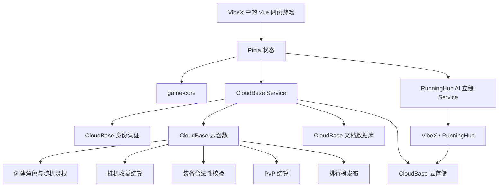

# 凡修录（EmberQuest）Vue 组件化保真重构与 CloudBase 最终架构方案（修订版）


> 修订原则：本版本删除了“按境界增加功法槽”等提前进行的玩法改动，明确组件化重构期间只做功能等价迁移，并要求正式玩家界面完全中文化。

## 1. 结论先行

### 1.1 是否有必要拆分

有必要。

当前《凡修录》仍然继承 EmberQuest 的单文件架构，`index.html` 同时包含：

- 全部 HTML 页面结构；
- 全部 CSS；
- 游戏静态数据；
- 角色与装备系统；
- 战斗与挂机算法；
- 存档、导入导出；
- Supabase 登录和联网功能；
- 排行榜、竞技场、公会、聊天和管理功能；
- 修仙主题覆盖层和本地化脚本。

当前修改版约为：

```text
文件大小：约 1.9 MB
代码行数：约 39,468 行
CSS：约 6,254 行
内联 JavaScript：约 30,345 行
函数声明：约 1,150 个
内联事件处理：约 624 处
document.getElementById：约 685 处
innerHTML 直接写入：约 263 处
Supabase 表访问：约 87 处
```

继续在单文件中增加灵根、AI 立绘、CloudBase、角色装备和联网排行，会明显提高以下风险：

- 修改一个模块影响其他模块；
- Codex 难以准确理解上下文；
- 全局变量和函数同名冲突；
- 页面渲染与游戏算法互相耦合；
- 无法单独测试挂机、战斗或存档；
- 云端迁移难以进行；
- 修仙化文本容易遗漏；
- 后续多人协作和版本管理困难。

---

### 1.2 是否建议用 Vue 重构

**建议使用 Vue 3，但不建议一次性推翻全部代码重写。**

最终推荐技术栈：

```text
Vue 3
TypeScript
Vite
Pinia
CloudBase Web SDK
Vitest
Playwright
```

暂不使用：

```text
Nuxt
SSR
Vue Router
Tailwind CSS
大型 UI 组件库
Phaser
微前端框架
```

原因是当前项目本质上是一个状态复杂、界面频繁更新的单页游戏。Vue 适合处理：

- 角色库；
- 多角色切换；
- 装备槽和背包；
- 战斗状态；
- 血条和修为条；
- 模态窗口；
- 任务列表；
- 挂机状态；
- 排行榜；
- 多端响应式界面。

但是 EmberQuest 已经积累了大量成熟挂机、战斗和存档逻辑。若直接全部重写为 Vue，最容易破坏的恰好是当前最有价值的挂机系统。

因此应采用：

> **先把原始 JavaScript 拆成框架无关模块，再逐页迁移到 Vue 组件。**

---

## 1.3 本次重构的冻结原则

本次工作的目标是**改变代码组织方式，不改变游戏玩法结果**。在 Vue 组件化、TypeScript 化和模块拆分完成并通过回归测试之前，冻结所有游戏性调整。

冻结范围包括但不限于：

- 装备槽数量、类型和互斥规则；
- 法术/技能/功法的装备数量和使用规则；
- 职业、种族、灵根、传承的数值效果；
- 等级、境界、经验、修为和升级曲线；
- 战斗公式、暴击、闪避、命中和减伤；
- 自动战斗、自动休息、自动补给和自动拾取；
- 离线挂机时长、模拟方式和收益；
- 区域、怪物、任务、副本、掉落和商店；
- 角色槽、存档、导入导出和云同步；
- 排行榜、竞技场、公会、聊天等已有联网功能。

允许在重构期间进行的改动只有：

- 文件拆分；
- 类型补充；
- 函数和模块边界整理；
- Vue 组件替换旧 DOM 渲染；
- 中文文案补全；
- 不改变操作路径的视觉修复；
- Bug 修复，但必须单独记录并通过回归测试。

以下内容统一延期到“功能等价重构验收”之后：

- 按境界增加功法槽；
- 精简或增加装备槽；
- 调整角色创建规则；
- 重做灵根概率和效果；
- 重做数值平衡；
- 删除原有系统；
- 增加新的修仙玩法。

重构期间的判断标准是：

> **相同存档、相同输入、相同随机种子，应得到与重构前一致的玩法结果。**

---

## 1.4 全中文要求

重构后的正式用户界面必须完全使用简体中文。这里的“完全中文”包括：

- 页面标题；
- 导航、标签页和按钮；
- 角色创建和角色选择；
- 属性、装备、技能/功法和物品说明；
- 区域、怪物、任务、副本和掉落；
- 战斗日志；
- 挂机与离线收益报告；
- 弹窗、Toast、确认框和提示；
- 登录、注册、存档、导入导出；
- 排行榜、竞技场、公会和聊天；
- 设置、帮助、版本说明和关于页面；
- 网络错误、验证错误和云函数错误；
- 图片生成状态和失败提示；
- 无障碍文本、`title`、`aria-label` 和图片替代文本。

内部代码标识符、数据库字段和第三方 API 字段可以保留英文，以降低迁移风险；但任何直接展示给玩家的文本都必须经过中文文案层输出。

推荐建立：

```text
src/locales/
├── zh-CN.ts
├── terminology.ts
└── error-messages.ts
```

即使第一版只支持中文，也要集中管理用户文案，避免英文散落在组件、核心算法和云端错误中。

---

## 2. 推荐的迁移策略

采用“渐进式替换”，而不是一次性重写。

```text
当前单文件版本
    ↓
第一阶段：原生 ES Module 拆分
    ↓
第二阶段：提取纯游戏核心 game-core
    ↓
第三阶段：Vue 接管页面和交互
    ↓
第四阶段：CloudBase 替换 Supabase
    ↓
第五阶段：删除旧 DOM 渲染代码
```

每一个阶段都必须保持游戏能够运行，并且可以回退到上一阶段。

---

## 3. 两种拆分方案比较

## 3.1 方案 A：只拆原生 JavaScript，不使用 Vue

目录示例：

```text
src/
├── main.js
├── config/
├── data/
├── core/
├── systems/
├── features/
├── services/
├── ui/
└── styles/
```

优点：

- 改动较小；
- 更容易保留旧逻辑；
- 不需要立刻改变渲染方式；
- 适合第一轮机械拆分。

缺点：

- 仍然需要大量 `getElementById`；
- 仍然需要手工更新 DOM；
- 仍然存在 `innerHTML` 拼接；
- 页面状态和游戏状态仍然容易错乱；
- 后续维护成本依然较高。

结论：

> 适合作为过渡步骤，不适合作为最终架构。

---

## 3.2 方案 B：直接完整重写为 Vue

优点：

- 最终结构干净；
- 组件和状态边界清晰；
- 可以彻底移除旧 DOM 操作。

缺点：

- 风险最高；
- 容易遗漏原项目隐藏规则；
- 挂机、离线结算、战斗、掉落和存档可能出现行为差异；
- 很难一次验证 39,000 多行代码对应的全部功能；
- 开发周期不可控。

结论：

> 不建议一次性进行。

---

## 3.3 最终选择

采用混合方案：

```text
第一步：
保留旧页面行为，先拆 ES Module。

第二步：
让游戏核心彻底脱离 DOM。

第三步：
使用 Vue 组件替换旧页面。

第四步：
移除旧 HTML 和旧 render 函数。
```

---

## 4. 最终项目目录

```text
fanxiulu/
├── index.html
├── package.json
├── vite.config.ts
├── tsconfig.json
├── public/
│   ├── assets/
│   │   ├── backgrounds/
│   │   ├── characters/
│   │   ├── equipment/
│   │   ├── skills/
│   │   ├── monsters/
│   │   └── audio/
│   └── favicon.ico
│
├── src/
│   ├── main.ts
│   ├── App.vue
│   │
│   ├── app/
│   │   ├── bootstrap.ts
│   │   ├── constants.ts
│   │   ├── featureFlags.ts
│   │   └── version.ts
│   │
│   ├── layouts/
│   │   ├── LoginLayout.vue
│   │   ├── CharacterSelectLayout.vue
│   │   └── GameLayout.vue
│   │
│   ├── views/
│   │   ├── LoginView.vue
│   │   ├── CharacterLibraryView.vue
│   │   └── GameView.vue
│   │
│   ├── components/
│   │   ├── common/
│   │   ├── character/
│   │   ├── combat/
│   │   ├── inventory/
│   │   ├── cultivation/
│   │   ├── world/
│   │   ├── social/
│   │   └── settings/
│   │
│   ├── stores/
│   │   ├── auth.store.ts
│   │   ├── account.store.ts
│   │   ├── characters.store.ts
│   │   ├── session.store.ts
│   │   ├── combat.store.ts
│   │   ├── inventory.store.ts
│   │   ├── world.store.ts
│   │   ├── social.store.ts
│   │   ├── settings.store.ts
│   │   └── ui.store.ts
│   │
│   ├── composables/
│   │   ├── useGameLoop.ts
│   │   ├── useAutoSave.ts
│   │   ├── useOfflineReward.ts
│   │   ├── useModal.ts
│   │   └── useResponsiveLayout.ts
│   │
│   ├── services/
│   │   ├── cloudbase/
│   │   │   ├── client.ts
│   │   │   ├── auth.service.ts
│   │   │   ├── save.service.ts
│   │   │   ├── leaderboard.service.ts
│   │   │   ├── pvp.service.ts
│   │   │   └── appearance.service.ts
│   │   ├── runninghub/
│   │   │   ├── appearance-api.ts
│   │   │   └── appearance-poller.ts
│   │   └── local/
│   │       ├── local-save.repository.ts
│   │       └── settings.repository.ts
│   │
│   ├── game-core/
│   │   ├── index.ts
│   │   ├── domain/
│   │   ├── data/
│   │   ├── systems/
│   │   ├── save/
│   │   ├── rng/
│   │   └── events/
│   │
│   ├── adapters/
│   │   ├── legacy-save.adapter.ts
│   │   ├── legacy-field.adapter.ts
│   │   ├── legacy-cloud.adapter.ts
│   │   └── battle-view.adapter.ts
│   │
│   ├── styles/
│   │   ├── tokens.css
│   │   ├── reset.css
│   │   ├── game-shell.css
│   │   ├── panels.css
│   │   ├── buttons.css
│   │   ├── inventory.css
│   │   ├── combat.css
│   │   ├── responsive.css
│   │   └── animations.css
│   │
│   └── types/
│       ├── character.ts
│       ├── combat.ts
│       ├── equipment.ts
│       ├── technique.ts
│       ├── world.ts
│       └── cloud.ts
│
├── cloudbase/
│   ├── functions/
│   │   ├── bootstrap-user/
│   │   ├── create-character/
│   │   ├── save-character/
│   │   ├── claim-afk-reward/
│   │   ├── equip-item/
│   │   ├── challenge-player/
│   │   ├── publish-character/
│   │   ├── get-leaderboard/
│   │   └── save-appearance/
│   ├── database/
│   │   ├── collections.md
│   │   ├── indexes.md
│   │   └── security-rules.json
│   └── shared/
│       ├── combat-engine/
│       ├── validation/
│       └── schemas/
│
├── tests/
│   ├── unit/
│   ├── integration/
│   ├── regression/
│   └── e2e/
│
└── legacy/
    ├── emberquest-original.html
    ├── fanxiulu-monolith.html
    └── migration-notes.md
```

---

## 5. 模块化后的 index.html

重构完成后，`index.html` 只保留应用入口：

```html
<!doctype html>
<html lang="zh-CN">
  <head>
    <meta charset="UTF-8" />
    <meta
      name="viewport"
      content="width=device-width, initial-scale=1.0, viewport-fit=cover"
    />
    <meta name="theme-color" content="#101a16" />
    <title>凡修录</title>
  </head>

  <body>
    <div id="app"></div>
    <script type="module" src="/src/main.ts"></script>
  </body>
</html>
```

目标：

```text
原 index.html：约 39,468 行
新 index.html：约 15～25 行
```

---

## 6. Vue 页面结构

## 6.1 App.vue

职责仅限于：

- 启动应用；
- 判断登录状态；
- 判断是否有角色；
- 决定显示登录、角色库还是游戏主界面；
- 挂载全局弹窗和 Toast。

```vue
<template>
  <LoginView v-if="screen === 'login'" />
  <CharacterLibraryView v-else-if="screen === 'characters'" />
  <GameView v-else />

  <GlobalModalHost />
  <ToastHost />
</template>
```

不要在 `App.vue` 中放战斗、装备或存档逻辑。

---

## 6.2 GameLayout.vue

保留 EmberQuest 当前三栏交互，不必重新设计布局：

```text
顶部栏
├── 角色名称
├── 境界
├── 修为
├── 灵石
└── 设置

三栏主体
├── 左栏：角色状态、装备摘要、挂机设置
├── 中栏：战斗、区域、背包、坊市等标签页
└── 右栏：行动队列、功法、任务摘要

移动端
├── 顶部角色 HUD
├── 中心内容
└── 底部导航
```

组件：

```text
GameLayout.vue
├── GameTopBar.vue
├── QuickActionBar.vue
├── CharacterSidebar.vue
├── GameCenterPanel.vue
├── ActionSidebar.vue
├── MobileGameHud.vue
├── MobileBottomNav.vue
└── GlobalPopupHost.vue
```

---

## 7. 角色模块

```text
components/character/
├── CharacterLibrary.vue
├── CharacterSlot.vue
├── CharacterCreator.vue
├── RootRollPanel.vue
├── HeritageSelection.vue
├── AppearanceEditor.vue
├── CharacterAvatar.vue
├── CharacterNameplate.vue
├── CharacterStats.vue
├── CharacterDetail.vue
└── CharacterSwitchConfirm.vue
```

### 角色创建流程

```text
输入姓名
→ 测定灵根
→ 选择初始传承
→ 调整默认外观
→ 创建角色
→ 可选 AI 生成立绘
```

### 数据逻辑

角色创建的随机灵根、初始属性和初始物品，不放在组件中计算。

组件只调用：

```ts
charactersStore.createCharacter(input)
```

真正算法位于：

```text
game-core/systems/character-creation.ts
```

正式联网时，最终结果由：

```text
CloudBase create-character 云函数
```

生成并确认。

---

## 8. 装备与背包组件

```text
components/inventory/
├── InventoryPanel.vue
├── InventoryTabs.vue
├── BagGrid.vue
├── ItemTile.vue
├── ItemTooltip.vue
├── ItemActionMenu.vue
├── PaperDoll.vue
├── EquipmentSlot.vue
├── EquipmentCompare.vue
├── TechniqueSlots.vue
└── TechniqueSlot.vue
```

重构阶段必须完整保留 EmberQuest 当前实际存在的全部装备槽、双手/副手关系、槽位限制、穿戴条件和属性计算。

不得在组件化过程中把装备系统缩减成“武器、衣服、饰品、鞋履”四个槽，也不得新增原版不存在的槽。具体槽位数量和内部字段，以当前可运行版本为唯一基线。

展示层可以将原英文名称翻译为符合修仙题材的中文，但只允许改显示文本：

```ts
const SLOT_DISPLAY_NAME: Record<string, string> = {
  // 键值沿用原版实际字段；中文名称由术语表统一管理。
}
```

原则：

```text
内部字段不变
装备槽数量不变
穿戴规则不变
属性计算不变
界面名称完整中文化
```

玩法改造必须等功能等价重构验收后，再作为独立版本实施。

---

## 9. 法术/功法模块

原 `spells` 系统在中文界面中可以显示为“功法”“法术”或当前修仙化版本已经采用的对应术语，但重构阶段不得改变其原有槽位、数量、学习条件、施放条件、冷却、法力消耗、自动施放顺序和战斗效果。

```text
components/cultivation/
├── TechniqueBook.vue
├── TechniqueCard.vue
├── EquippedTechniqueSlots.vue
├── TechniqueDetail.vue
├── CultivationProgress.vue
├── RealmBadge.vue
└── BreakthroughDialog.vue
```

重构后的类型首先忠实表达原始数据，不额外引入“境界增加槽位”“灵根亲和”等新规则：

```ts
interface TechniqueDefinition {
  id: string
  nameKey: string
  manaCost: number
  cooldown: number
  effects: TechniqueEffect[]
  requirements: LegacyTechniqueRequirements
  autoCast: LegacyAutoCastRule
}
```

槽位数量和可装备规则必须由旧版逻辑适配而来：

```ts
getLegacyTechniqueSlotState(character, saveVersion)
```

Vue 组件只读取并展示该结果，不能自行写死新的境界规则。

“炼气 1 个、筑基 2 个、结丹 3 个、元婴 4 个”的规则从本次重构方案中删除，待重构完成、全部功能验证通过后，再作为独立玩法提案评估。

---

## 10. 战斗模块

战斗是重构中最重要的保护对象。

```text
game-core/systems/combat/
├── battle-engine.ts
├── attack-resolver.ts
├── damage-calculator.ts
├── status-engine.ts
├── technique-engine.ts
├── equipment-effects.ts
├── enemy-ai.ts
├── combat-log.ts
└── combat-types.ts
```

### 核心原则

战斗核心不得：

- 读取 DOM；
- 修改 HTML；
- 弹出 Toast；
- 访问 CloudBase；
- 直接写 localStorage；
- 使用未注入的全局 `Math.random()`；
- 依赖 Vue 或 Pinia。

输入：

```ts
interface BattleInput {
  attacker: FighterSnapshot
  defender: FighterSnapshot
  seed: string
  mode: "pve" | "boss" | "pvp"
}
```

输出：

```ts
interface BattleResult {
  winnerId: string
  turns: BattleTurn[]
  rewards: RewardResult
  finalState: BattleState
}
```

Vue 组件只负责播放结果：

```text
CombatPanel.vue
├── PlayerCombatCard.vue
├── EnemyCombatCard.vue
├── HealthBar.vue
├── ManaBar.vue
├── CombatAnimationLayer.vue
├── FloatingDamage.vue
└── CombatLog.vue
```

---

## 11. 挂机系统拆分

原 EmberQuest 挂机系统应保留算法，不重写玩法。

```text
game-core/systems/afk/
├── afk-engine.ts
├── afk-session.ts
├── offline-simulator.ts
├── auto-rest.ts
├── auto-potion.ts
├── auto-loot.ts
├── afk-goals.ts
└── afk-report.ts
```

### 实时挂机

```text
useGameLoop
→ combatStore.tick()
→ game-core 执行一轮
→ 返回状态变化
→ Pinia 更新
→ Vue 自动刷新界面
```

### 离线挂机

```text
读取上次离开时间
→ 计算离线时长
→ 设置最大可结算时长
→ game-core 聚合模拟
→ 生成离线报告
→ 云端校验收益
→ 显示 AFKReturnModal
```

### 不建议的做法

不要在离线数小时后逐帧执行几百万次普通攻击。

应当保留或改造为：

- 分段模拟；
- 批量结算；
- 统计击杀速度；
- 处理关键事件；
- 限制最大循环次数；
- 生成聚合战报。

---

## 12. Pinia 状态设计

## 12.1 authStore

```text
登录状态
CloudBase 用户 ID
匿名账号状态
令牌状态
退出登录
账号绑定
```

## 12.2 charactersStore

```text
角色列表
当前激活角色 ID
创建角色
切换角色
更新角色
删除测试角色
```

## 12.3 sessionStore

```text
当前角色运行状态
当前区域
当前标签页
游戏速度
最后保存时间
在线/离线状态
```

## 12.4 combatStore

```text
当前敌人
当前战斗
回合日志
自动战斗开关
行动队列
战斗速度
状态效果
```

## 12.5 inventoryStore

```text
背包
装备
功法槽
物品筛选
装备比较
选中物品
```

## 12.6 worldStore

```text
区域
秘境
任务
怪物图鉴
每周 Boss
```

## 12.7 socialStore

```text
排行榜
竞技场对手
战斗记录
公会和聊天
```

## 12.8 uiStore

```text
当前屏幕
当前标签页
弹窗栈
Toast
移动端面板
界面偏好
```

### 注意

不要建立一个包含全部内容的 `gameStore`。

超大 Store 会把原单文件问题重新复制到 Pinia 中。

---

## 13. 静态游戏数据

静态配置不应放入组件，也不应在 P0 全部写入数据库。

```text
src/game-core/data/
├── roots.ts
├── heritages.ts
├── realms.ts
├── zones.ts
├── monsters.ts
├── items.ts
├── equipment.ts
├── techniques.ts
├── quests.ts
├── bosses.ts
├── loot-tables.ts
└── balance.ts
```

数据定义和运行时状态必须分开：

```text
EquipmentDefinition
代表游戏中“青锋剑”的固定配置。

OwnedEquipment
代表某个玩家拥有的一把具体青锋剑。
```

---

## 14. 存档兼容方案

重构时不要立刻放弃旧 EmberQuest 存档。

建立三层：

```text
旧存档
→ legacy-save.adapter
→ 当前领域模型
→ 新存档格式
```

### 第一阶段

内部仍保留旧字段：

```text
level
xp
gold
race
class
spellbook
```

界面通过适配器显示：

```text
境界
修为
灵石
灵根
传承
功法
```

### 第二阶段

引入新存档版本：

```ts
interface SaveEnvelope {
  game: "fanxiulu"
  schemaVersion: 3
  gameVersion: string
  savedAt: string
  characters: CharacterSave[]
  settings: GameSettings
}
```

### 第三阶段

只在读写边界转换：

```text
loadLegacySave()
migrateSaveV1ToV2()
migrateSaveV2ToV3()
validateSave()
```

不要让兼容判断散落在每个 Vue 组件中。

---

## 15. 最终 CloudBase 架构



---

## 16. CloudBase 数据库最小结构

为了降低迁移工作量，第一版不要立即把原游戏全部拆成几十张集合。

## 16.1 users

```text
_id
displayName
activeCharacterId
createdAt
lastLoginAt
```

## 16.2 character_saves

保存完整角色 JSON 快照：

```text
_id
ownerId
slot
schemaVersion
gameVersion
data
updatedAt
```

这与原项目按角色槽保存整份数据的方式接近，迁移成本最低。

## 16.3 public_characters

只保存排行榜和公开详情需要的数据：

```text
characterId
ownerId
name
avatarUrl
rootSummary
realm
power
rating
equipmentSummary
techniqueSummary
updatedAt
```

## 16.4 pvp_snapshots

```text
characterId
ownerId
snapshotVersion
battleStats
equipment
techniques
rating
wins
losses
updatedAt
```

## 16.5 battle_records

```text
attackerId
defenderId
seed
result
ratingChange
battleLog
createdAt
```

## 16.6 appearance_jobs

```text
ownerId
characterId
taskId
status
imageUrl
model
seed
createdAt
updatedAt
```

---

## 17. CloudBase 云函数

P0 最低需要：

```text
bootstrap-user
create-character
load-characters
save-character
claim-afk-reward
equip-item
publish-character
challenge-player
get-leaderboard
save-appearance
```

### 必须由云函数确认

```text
随机灵根
初始属性
挂机收益
境界突破
装备是否合法
PvP 胜负
竞技积分变化
排行榜数据
```

### 可以留在客户端

```text
战斗动画
普通挂机画面
本地战斗日志
装备预览
属性对比预览
界面筛选
音效
视觉特效
```

---

## 18. Supabase 到 CloudBase 的替换方式

不要在所有组件中直接调用 CloudBase。

建立统一接口：

```ts
interface GameCloudRepository {
  signInAnonymously(): Promise<UserSession>
  loadCharacters(): Promise<CharacterSave[]>
  saveCharacter(save: CharacterSave): Promise<void>
  claimAfkReward(input: ClaimAfkInput): Promise<ClaimAfkResult>
  challengePlayer(input: ChallengeInput): Promise<BattleResult>
  getLeaderboard(type: LeaderboardType): Promise<LeaderboardEntry[]>
}
```

迁移期间可以同时实现：

```text
SupabaseGameRepository
CloudBaseGameRepository
LocalGameRepository
```

由环境变量选择：

```text
VITE_CLOUD_PROVIDER=cloudbase
```

这样迁移 CloudBase 时，不需要修改 Vue 组件和游戏核心。

---

## 19. AI 角色立绘模块

```text
services/runninghub/
├── appearance-api.ts
├── appearance-poller.ts
├── prompt-builder.ts
└── appearance-types.ts
```

流程：

```text
角色创建完成
→ 使用默认立绘进入游戏
→ 玩家主动点击 AI 生成
→ VibeX / RunningHub 创建任务
→ 轮询任务状态
→ 得到图片 URL
→ CloudBase 保存图片信息
→ 更新角色立绘
```

AI 生成失败时：

- 不回滚角色；
- 不影响挂机；
- 不影响对战；
- 保留默认立绘；
- 允许玩家稍后重试。

---

## 20. 样式拆分

现有 6,000 多行 CSS 不应全部改写成 Vue scoped CSS。

建议分三层：

### 20.1 全局设计变量

`tokens.css`

```css
:root {
  --color-bg-cave: #101a16;
  --color-panel: #17231d;
  --color-jade: #74a98f;
  --color-gold: #d7b56d;
  --color-danger: #a84d45;
  --color-text: #e7e0ce;
  --radius-panel: 8px;
  --shadow-panel: 0 12px 30px rgba(0, 0, 0, 0.35);
}
```

### 20.2 通用游戏组件样式

```text
panels.css
buttons.css
bars.css
tooltips.css
modals.css
animations.css
```

### 20.3 单组件样式

放在 `.vue` 文件的：

```vue
<style scoped>
</style>
```

不要把所有样式都 scoped，否则会造成重复 CSS 和主题覆盖困难。

---

## 21. 不使用 Vue Router 的原因

当前游戏主要是：

```text
登录屏幕
角色库屏幕
游戏屏幕
游戏内标签页
```

P0 可以使用 Pinia 的：

```ts
uiStore.screen
uiStore.activeTab
```

切换，不必引入路由。

以后需要以下能力时再增加 Vue Router：

- 可以分享的角色详情链接；
- 排行榜角色公开链接；
- 管理后台独立地址；
- 浏览器前进后退；
- 深层页面刷新恢复。

---

## 22. 不使用 Phaser 的原因

当前 EmberQuest 的挂机与战斗主要是数据和界面驱动。

P0 继续使用：

- Vue；
- CSS 动画；
- Web Animations；
- SVG；
- Canvas 小特效。

只有在需要以下内容时再引入 Phaser：

- 横版角色战斗；
- 粒子系统；
- 大量角色动作；
- 技能轨迹；
- 完整战斗回放；
- 帧动画资源管理。

不要为了一个简单挂机战斗界面，同时维护 Vue 和 Phaser 两套状态。

---

## 23. 迁移阶段

## 阶段 0：冻结基线

产物：

```text
legacy/emberquest-original.html
legacy/fanxiulu-monolith.html
```

完成：

- 原始文件校验；
- 当前版本截图；
- 创建角色测试；
- 自动战斗测试；
- 离线挂机测试；
- 装备测试；
- 存档导入导出测试；
- 云存档和排行测试记录。

---

## 阶段 1：机械拆分，不改变行为

先拆：

```text
styles/
data/
audio/
cloud/
save/
localization/
```

此阶段仍可保留原 DOM 渲染。

目标：

- `index.html` 不再包含大段 CSS；
- 静态数据离开主脚本；
- Supabase 逻辑离开主脚本；
- 存档逻辑离开主脚本；
- 所有模块使用明确的 import/export；
- 游戏行为与原版一致。

---

## 阶段 2：提取 game-core

优先提取：

```text
属性计算
攻击结算
怪物生成
掉落计算
装备属性
功法效果
挂机 tick
离线挂机
存档迁移
随机数
```

验收：

- game-core 可在 Node 测试环境运行；
- 不需要浏览器 DOM；
- 固定 seed 得到固定战斗结果；
- 旧版和新版输出可以做回归对比。

---

## 阶段 3：Vue 接管外壳

先迁移低风险页面：

```text
登录
角色库
设置
Toast
模态窗口
顶部栏
```

旧战斗页面暂时嵌入 Vue 外壳。

---

## 阶段 4：Vue 接管角色和背包

迁移：

```text
角色创建
角色详情
纸娃娃装备
背包
功法
属性
灵根
外观
```

---

## 阶段 5：Vue 接管挂机和战斗

迁移：

```text
战斗面板
怪物信息
血条
法力条
行动队列
自动战斗
战斗日志
离线收益弹窗
```

此阶段是风险最高阶段，必须有回归测试。

---

## 阶段 6：迁移联网层

```text
Supabase Repository
→ CloudBase Repository
```

先完成：

- 匿名登录；
- 角色存档；
- 排行榜；
- PvP；
- AI 图片信息。

公会、聊天和管理员工具放到后续阶段。

---

## 阶段 7：删除旧代码

只有当所有核心页面都由 Vue 接管后，才删除：

```text
旧 render 函数
旧 onclick
旧 getElementById
旧 innerHTML 模板
旧 Supabase 客户端
修仙本地化覆盖脚本
```

---

## 24. 第一阶段最低拆分范围

这里的“最低拆分范围”只表示代码迁移优先级，不表示裁剪、关闭或改变任何原有玩法。第一轮只要求：

```text
index.html
main.ts
App.vue
GameLayout.vue
CharacterLibrary.vue
CharacterDetail.vue
InventoryPanel.vue
CombatPanel.vue
AfkReturnModal.vue

game-core/
├── character.ts
├── combat.ts
├── afk.ts
├── equipment.ts
├── save.ts
└── data/
```

联网只做：

```text
匿名身份
角色存档
角色切换
挂机收益
PvP
排行榜
AI 立绘地址
```

原有以下模块可以暂时继续通过兼容层运行，后续再迁移其 Vue 界面：

```text
公会
聊天
炼金
赌场
符文
佣兵
宠物
管理后台
```

但这些功能不得因为重构而默认关闭、删除或改变规则。迁移期间的功能开关必须继承当前版本实际状态：

```ts
export const featureFlags = loadLegacyFeatureFlags()
```

未迁移的模块采用“旧界面桥接”继续工作，直到对应 Vue 组件通过功能等价验收后再替换。

---

## 25. 测试方案

## 25.1 单元测试

必须覆盖：

```text
属性计算
战力计算
攻击伤害
暴击
闪避
状态效果
掉落
离线挂机
原有技能/功法槽规则
装备要求
存档迁移
```

## 25.2 中文完整性测试

建立自动和人工双重检查：

```text
1. 扫描 Vue 模板中的可见英文。
2. 扫描 Toast、alert、confirm、prompt 和异常消息。
3. 扫描战斗日志、任务文本、物品说明和区域文本。
4. 扫描 CloudBase 云函数返回的 message。
5. 扫描第三方 SDK 错误是否经过中文映射。
6. Playwright 遍历所有主页面并截图审查。
7. 检查 title、aria-label、placeholder、alt 和空状态。
```

允许保留的英文仅限：

- 玩家主动输入的内容；
- 无法翻译的正式产品名或协议名；
- 开发者模式和控制台日志；
- 内部字段名、类型名和 API 参数。

正式玩家界面不得直接显示原始英文异常，例如：

```text
Failed to fetch
Unauthorized
Invalid login credentials
Network request failed
```

必须映射为明确中文提示。

---

## 25.3 固定随机种子

所有战斗测试使用 seed：

```ts
simulateBattle(input, createSeededRandom("test-001"))
```

避免测试结果随机变化。

## 25.4 回归测试

同时运行：

```text
旧版函数
新版 game-core
```

输入相同角色、怪物和随机种子，比较：

```text
伤害
回合数
经验/修为
金币/灵石
掉落
最终生命
战斗日志关键事件
```

## 25.5 端到端测试

Playwright 测试流程：

```text
打开游戏
→ 匿名登录
→ 创建角色
→ 切换角色
→ 装备物品
→ 开启自动战斗
→ 保存
→ 刷新页面
→ 恢复角色
→ 领取离线收益
→ 挑战玩家
→ 查看排行榜
```

---

## 26. Codex 任务拆分

不要一次让 Codex“把 39,000 行改成 Vue”。

### 任务 1：建立项目壳

```text
创建 Vue 3 + TypeScript + Vite 项目。
添加 Pinia。
保留原版 HTML 到 legacy 目录。
搭建 App、布局和样式入口。
不迁移游戏逻辑。
```

### 任务 2：提取静态数据

```text
将当前版本实际使用的角色、灵根/种族映射、传承/职业映射、区域、怪物、物品、技能和掉落表拆到 game-core/data。
保持原字段、数量、数值、条件和关联关系不变。
只补充 TypeScript 类型和中文显示键。
不得在此任务中新增境界槽位、灵根亲和或数值平衡。
```

### 任务 3：提取存档

```text
提取本地存档、压缩、导入、导出、版本迁移。
建立 SaveRepository 接口。
编写旧存档回归测试。
```

### 任务 4：提取战斗

```text
将攻击、状态、怪物、掉落和日志从 DOM 中分离。
建立纯函数 battle-engine。
不得引用 document、window、Vue 或 CloudBase。
```

### 任务 5：提取挂机

```text
迁移 afkTick、离线模拟、自动休息、自动补给和挂机目标。
验证同一输入的收益与旧版基本一致。
```

### 任务 6：迁移角色和背包 UI

```text
建立角色库、角色详情、装备槽、背包和功法组件。
用 Pinia 管理状态。
删除对应旧 render 函数。
```

### 任务 7：迁移战斗 UI

```text
建立 CombatPanel、血条、日志、行动队列和自动战斗控件。
game-core 只返回结果，Vue 负责显示。
```

### 任务 8：接入 CloudBase

```text
实现 CloudBaseGameRepository。
替换 SupabaseGameRepository。
敏感结算通过云函数。
```

### 任务 9：全中文审计

```text
集中迁移所有用户可见文案到 zh-CN 文案层。
覆盖按钮、提示、战报、错误、空状态、无障碍文本和云端返回信息。
使用 Playwright 遍历页面并记录英文遗漏。
中文审计通过前，不进入正式部署。
```

### 任务 10：接入 AI 立绘

```text
接入 VibeX / RunningHub。
保存任务状态、图片 URL、seed 和模型版本。
失败时保留默认立绘。
```

---

## 27. 验收标准

完成组件化重构后必须同时满足“功能等价”和“完全中文”两类验收。

### 27.1 功能等价


- `index.html` 不超过 30 行；
- 主业务代码全部为 ES Module；
- Vue 组件内不包含战斗算法；
- game-core 不引用 DOM；
- 不再使用 HTML 内联 `onclick`；
- 关键页面不再直接写 `innerHTML`；
- Pinia Store 不直接操作 DOM；
- CloudBase 调用集中在 service/repository；
- 原始存档可以导入；
- 自动战斗行为基本保持；
- 离线挂机收益能够回归验证；
- 多角色槽和切换仍然可用；
- 装备、功法、任务和区域仍可运行；
- AI 图片失败不影响游戏；
- PvP 和排行榜不能由客户端直接提交胜负；
- 移动端仍保留原有主操作路径。

### 27.2 完全中文

- `<html lang="zh-CN">`；
- 所有玩家可见页面均为简体中文；
- 不残留 EmberQuest 英文标题、按钮、说明或 About 内容；
- 登录、注册、存档、网络、CloudBase 和 AI 生成错误均为中文；
- 战斗日志、挂机报告、任务、装备、技能和区域说明均为中文；
- 排行榜、竞技场、公会、聊天和管理员界面均为中文；
- `placeholder`、`title`、`alt`、`aria-label` 和空状态均为中文；
- 浏览器界面中不得直接出现第三方 SDK 原始英文错误；
- 玩家输入和正式专有名词除外。

### 27.3 游戏性冻结

- 重构前后装备槽数量和规则一致；
- 重构前后技能/功法槽数量和规则一致；
- 战斗、挂机、离线结算、掉落和成长结果通过固定 seed 回归；
- 不以“修仙化”为理由在重构阶段改变数值和解锁规则；
- 所有计划中的玩法调整进入单独的“重构后玩法版本”，不混入组件化提交。

---

## 28. 最终推荐架构

```text
表现层：
Vue 3 单文件组件

状态层：
Pinia

核心规则：
框架无关的 TypeScript game-core

本地数据：
LocalStorage 兼容层
后续可迁移 IndexedDB

云端：
腾讯云 CloudBase

联网安全：
CloudBase 云函数权威结算

AI 图片：
VibeX / RunningHub

构建：
Vite

测试：
Vitest + Playwright

部署：
VibeX 页面或 CloudBase 静态托管
```

最终原则：

> **Vue 只负责中文界面，Pinia 负责状态，game-core 原样承接现有游戏规则，CloudBase 负责可信联网数据，RunningHub 只负责 AI 图片；重构完成前不修改玩法。**

这套结构既能保住 EmberQuest 已经成熟的挂机和战斗逻辑，也能让《凡修录》后续继续增加灵根、装备、功法、AI 立绘、角色切换、对战和排行榜，而不再回到一个接近四万行的单文件。
